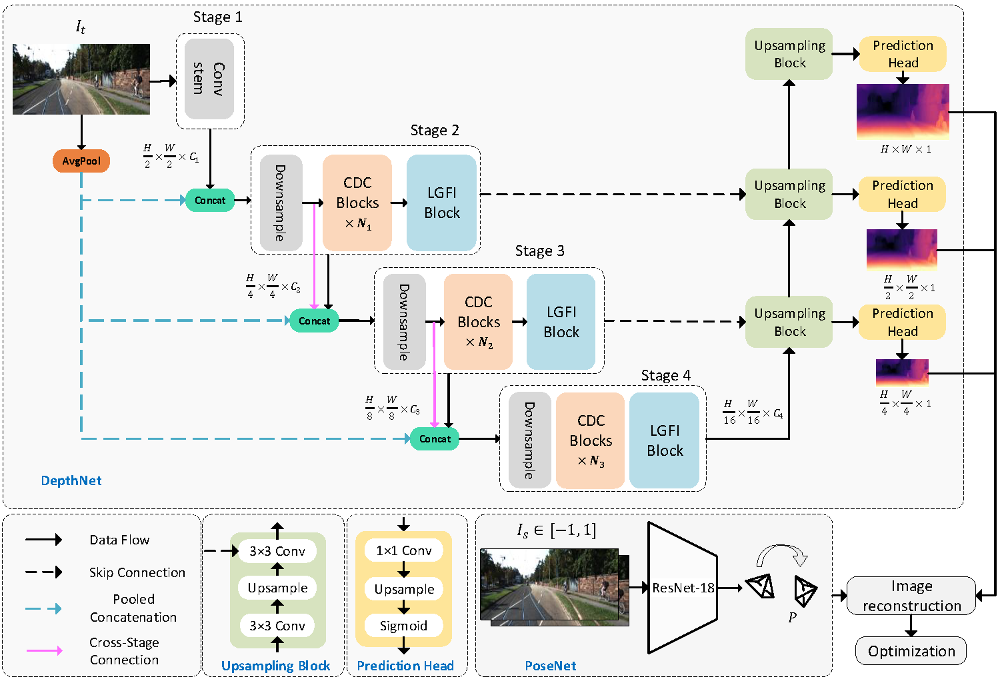
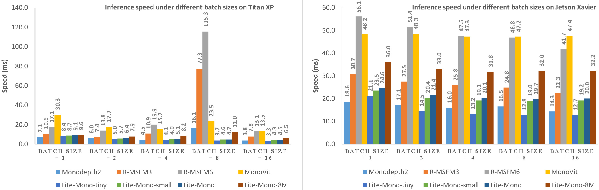
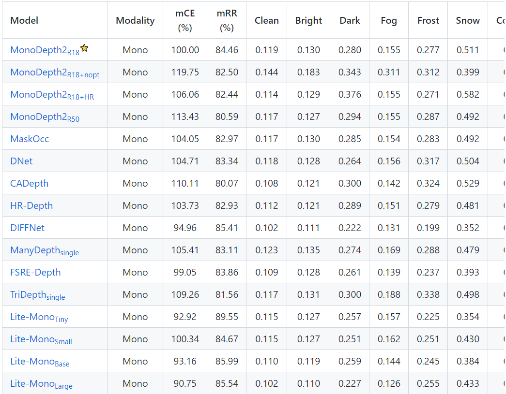

  
# Lite-Mono 
**A Lightweight CNN and Transformer Architecture for Self-Supervised Monocular Depth Estimation**
  [[paper link]](https://arxiv.org/abs/2211.13202)
  
  Ning Zhang*, Francesco Nex, George Vosselman, Norman Kerle
  
  

(Lite-Mono-8m 1024x320) 
  

## Table of Contents
- [Overview](#overview)
- [Results](#results)
  - [KITTI](#kitti) 
  - [Speed Evaluation](#speed-evaluation)
  - [Robustness](#robustness)
- [Data Preparation](#data-preparation)
- [Single Image Test](#single-image-test)
- [Evaluation](#evaluation)
- [Training](#training)
  - [Dependency Installation](#dependency-installation)
  - [Start Training](#start-training)
  - [Tensorboard Visualization](#tensorboard-visualization)
- [Citation](#citation)

## Overview

## Results
### KITTI
You can download the trained models using the links below.  

|     --model     | Params | ImageNet Pretrained | Input size |  Abs Rel  |   Sq Rel  |    RMSE   |  RMSE log | delta < 1.25 | delta < 1.25^2 | delta < 1.25^3 |
|:---------------:|:------:|:-------------------:|:----------:|:---------:|:---------:|:---------:|:---------:|:------------:|:--------------:|:--------------:|
|  [**lite-mono**](https://surfdrive.surf.nl/files/index.php/s/CUjiK221EFLyXDY)  |  3.1M  |         [yes](https://surfdrive.surf.nl/files/index.php/s/InMMGd5ZP2fXuia)         |   640x192  | 0.107 | 0.765 | 4.561 | 0.183 |   0.886  |    0.963   |    0.983   |
| [lite-mono-small](https://surfdrive.surf.nl/files/index.php/s/8cuZNH1CkNtQwxQ) |  2.5M  |         [yes](https://surfdrive.surf.nl/files/index.php/s/DYbWV4bsWImfJKu)         |   640x192  |   0.110   |   0.802   |   4.671   |   0.186   |     0.879    |      0.961     |      0.982     |
|  [lite-mono-tiny](https://surfdrive.surf.nl/files/index.php/s/TFDlF3wYQy0Nhmg) |  2.2M  |         yes         |   640x192  |   0.110   |   0.837   |   4.710   |   0.187   |     0.880    |      0.960     |      0.982     |
| [**lite-mono-8m**](https://surfdrive.surf.nl/files/index.php/s/UlkVBi1p99NFWWI) |  8.7M  |         [yes](https://surfdrive.surf.nl/files/index.php/s/oil2ME6ymoLGDlL)         |   640x192  |  0.101  |  0.729 | 4.454 |   0.178  |     0.897    |      0.965     |      0.983     |
|  [**lite-mono**](https://surfdrive.surf.nl/files/index.php/s/IK3VtPj6b5FkVnl)  |  3.1M  |         yes         |  1024x320  | 0.102 | 0.746 | 4.444 | 0.179 |   0.896  |    0.965   |    0.983   |
| [lite-mono-small](https://surfdrive.surf.nl/files/index.php/s/w8mvJMkB1dP15pu) |  2.5M  |         yes         |  1024x320  |   0.103   |   0.757   |   4.449   |   0.180   |     0.894    |      0.964     |      0.983     |
|  [lite-mono-tiny](https://surfdrive.surf.nl/files/index.php/s/myxcplTciOkgu5w) |  2.2M  |         yes         |  1024x320  |   0.104   |   0.764   |   4.487   |   0.180   |     0.892    |      0.964     |      0.983     |
| [**lite-mono-8m**](https://surfdrive.surf.nl/files/index.php/s/mgonNFAvoEJmMas) |  8.7M  |         yes         |  1024x320  |  0.097  |  0.710 | 4.309 |   0.174  |     0.905    |      0.967     |      0.984     |

### Speed Evaluation

### Robustness

The [RoboDepth Challenge Team](https://github.com/ldkong1205/RoboDepth) is evaluating the robustness of different depth estimation algorithms. Lite-Mono has achieved the best robustness to date.

## Data Preparation
Please refer to [Monodepth2](https://github.com/nianticlabs/monodepth2) to prepare your KITTI data. 

## Single Image Test
    python test_simple.py --load_weights_folder path/to/your/weights/folder --image_path path/to/your/test/image

## Evaluation
    python evaluate_depth.py --load_weights_folder path/to/your/weights/folder --data_path path/to/kitti_data/ --model lite-mono

## Training
#### dependency installation 
    pip install 'git+https://github.com/saadnaeem-dev/pytorch-linear-warmup-cosine-annealing-warm-restarts-weight-decay'
    
#### start training
    python train.py --data_path path/to/your/data --model_name mytrain --batch_size 12
    
#### tensorboard visualization
    tensorboard --log_dir ./tmp/mytrain

## Citation

    @article{zhang2022lite,
    title={Lite-Mono: A Lightweight CNN and Transformer Architecture for Self-Supervised Monocular Depth Estimation},
    author={Zhang, Ning and Nex, Francesco and Vosselman, George and Kerle, Norman},
    journal={arXiv preprint arXiv:2211.13202},
    year={2022}
    }